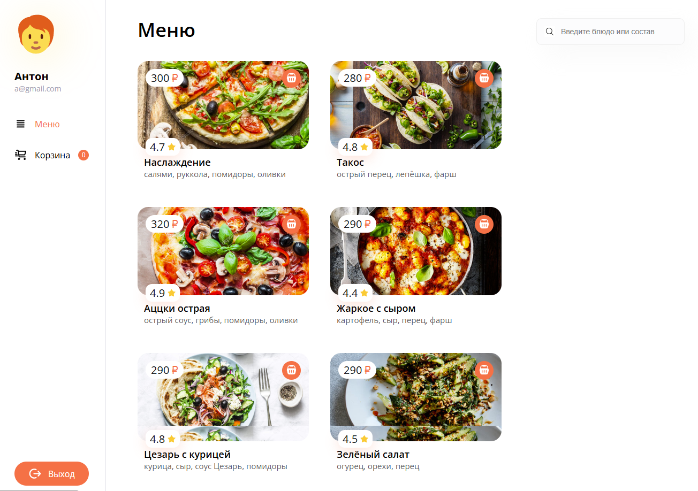

# Pizza App

Учебный проект написан на языке TypeScript с использованием библиотеки React и собран при помощи Vite

## Описание

Приложение позволяет легко выбрать и заказать любимую пиццу всего за несколько кликов! В нашем меню вы найдете широкий ассортимент пицц.

## Основные функции

* _Авторизация_: Вы можете создать свой аккаунт или авторизоваться, если он у вас уже есть. (тестовый login: a@gmail.com && password: 123)

* _Выбор пиццы_: Возможность выбора различных видов пиццы из нашего обширного меню.

* _Оформление заказа_: Простая форма для ввода данных о доставке и оплате.

## Как начать пользоваться?

1. Зарегистрируйтесь или войдите в свой аккаунт.
2. Выберите понравившуюся пиццу и добавьте ее в корзину.
3. Оформите заказ.
4. Наслаждайтесь своей пиццей!

## Контакты

Если у вас есть вопросы или предложения, пожалуйста, свяжитесь со мной по электронной почте: demargorn@gmail.com.

